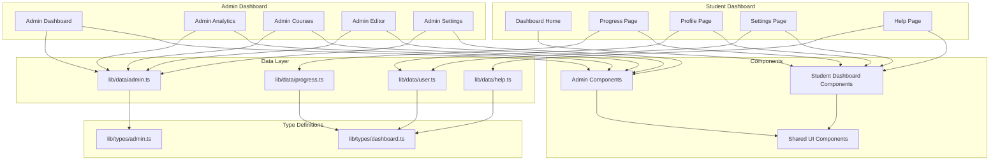

# Dashboard Pages Implementation Plan

## Overview

This document outlines the implementation plan for new dashboard pages in the Nihongo Learn platform, including both admin dashboard pages and student dashboard subpages. The implementation will follow the existing architecture patterns and use mock data from `lib/data`.

## Project Context

**Memory Bank Status**: Active
**Current Date**: 2026-01-29
**Project Phase**: Development Phase

### Existing Infrastructure

- **Framework**: Next.js 16.1.4 with App Router
- **Language**: TypeScript with strict mode
- **Styling**: Tailwind CSS v4 with Shadcn UI
- **Animation**: Motion (Framer Motion) 12.27.2
- **Data Layer**: Mock data in `lib/data/` with TypeScript interfaces in `lib/types/`

### Pages to Implement

#### Admin Dashboard Pages
1. **Admin Dashboard** (`/admin`) - Main overview with metrics and activity feed
2. **Admin Analytics** (`/admin/analytics`) - Data visualization and analytics
3. **Admin Courses** (`/admin/courses`) - Course management interface
4. **Admin Editor** (`/admin/editor/[lessonId]`) - TipTap-based lesson editor
5. **Admin Settings** (`/admin/settings`) - Platform configuration

#### Student Dashboard Subpages
1. **Progress** (`/dashboard/progress`) - Detailed progress tracking
2. **Profile** (`/dashboard/profile`) - User profile management
3. **Settings** (`/dashboard/settings`) - User preferences
4. **Help** (`/dashboard/help`) - FAQ and support

---

## Architecture Overview

### System Architecture



### Route Structure

```mermaid
graph LR
    subgraph "App Router Structure"
        A[app/]
        A1[admin/]
        A2[dashboard/]
    end

    subgraph "Admin Routes"
        A1 --> A1A[page.tsx - Dashboard]
        A1 --> A1B[analytics/page.tsx]
        A1 --> A1C[courses/page.tsx]
        A1 --> A1D[editor/[lessonId]/page.tsx]
        A1 --> A1E[settings/page.tsx]
    end

    subgraph "Student Dashboard Routes"
        A2 --> A2A[page.tsx - Home]
        A2 --> A2B[progress/page.tsx]
        A2 --> A2C[profile/page.tsx]
        A2 --> A2D[settings/page.tsx]
        A2 --> A2E[help/page.tsx]
    end
```

---

## Phase 1: Admin Dashboard Implementation

### 1.1 Admin Dashboard Main Page

**Route**: [`app/admin/page.tsx`](app/admin/page.tsx)

**Components to Create**:
- `AdminSidebar` - Navigation menu with links to all admin pages
- `AdminHeader` - Search bar, notifications, user profile
- `MetricCard` - Key performance indicator cards
- `ActivityFeed` - Recent platform activities table
- `PopularCoursesCard` - Top courses overview
- `PlatformHealthCard` - System status indicator

**Data Requirements**:
```typescript
// lib/types/admin.ts
export interface AdminMetric {
  label: string;
  value: string | number;
  change: number;
  trend: 'up' | 'down' | 'neutral';
  badge?: {
    count: number;
    color: string;
  };
}

export interface ActivityItem {
  id: string;
  type: 'new_student' | 'course_update' | 'new_subscription' | 'system_alert';
  details: string;
  timestamp: string;
  status: 'completed' | 'reviewing' | 'critical';
}

export interface PlatformHealth {
  status: 'optimal' | 'degraded' | 'down';
  responseTime: string;
  uptime: string;
}
```

**Mock Data**: Create `lib/data/admin.ts`
```typescript
export const adminMetrics: AdminMetric[] = [
  { label: 'Total Students', value: 12482, change: 12.5, trend: 'up' },
  { label: 'Active Courses', value: 156, change: 3.2, trend: 'up' },
  { label: 'Monthly Revenue', value: '¥2,450,000', change: 8.4, trend: 'up' },
  { label: 'Pending Review', value: 24, change: 0, trend: 'neutral', badge: { count: 18, color: 'orange' } }
];

export const recentActivities: ActivityItem[] = [...];
export const platformHealth: PlatformHealth = {...};
```

### 1.2 Admin Analytics Page

**Route**: [`app/admin/analytics/page.tsx`](app/admin/analytics/page.tsx)

**Components to Create**:
- `DateRangePicker` - Date filter for analytics
- `MetricChart` - Line/bar chart for trends
- `EngagementMetrics` - User engagement data cards
- `RevenueChart` - Revenue visualization
- `StudentGrowthChart` - Student acquisition trends
- `CoursePerformanceChart` - Course completion rates

**Data Requirements**:
```typescript
export interface AnalyticsData {
  dateRange: { start: string; end: string };
  metrics: {
    totalUsers: number;
    activeUsers: number;
    revenue: number;
    completionRate: number;
  };
  charts: {
    userGrowth: ChartDataPoint[];
    revenue: ChartDataPoint[];
    engagement: ChartDataPoint[];
  };
}

export interface ChartDataPoint {
  date: string;
  value: number;
  label?: string;
}
```

**Chart Library**: Use `recharts` or `@tanstack/react-charts` for visualizations

### 1.3 Admin Courses Page

**Route**: [`app/admin/courses/page.tsx`](app/admin/courses/page.tsx)

**Components to Create**:
- `CourseTable` - Table listing all courses
- `CourseFilters` - Filter by JLPT level, status, date
- `CourseStatusBadge` - Published/draft/archived badges
- `CourseActions` - Edit, delete, duplicate actions
- `AddCourseModal` - Create new course dialog

**Data Requirements**:
```typescript
export interface CourseManagementData {
  id: string;
  title: string;
  level: 'N5' | 'N4' | 'N3' | 'N2' | 'N1';
  status: 'published' | 'draft' | 'archived';
  students: number;
  rating: number;
  revenue: number;
  createdDate: string;
  lastUpdated: string;
}
```

### 1.4 Admin Editor Page (TipTap Integration)

**Route**: [`app/admin/editor/[lessonId]/page.tsx`](app/admin/editor/[lessonId]/page.tsx)

**Dependencies to Install**:
```bash
pnpm add @tiptap/react @tiptap/starter-kit @tiptap/extension-placeholder @tiptap/extension-link @tiptap/extension-image
```

**Components to Create**:
- `EditorHeader` - Title input, save/publish buttons, autosave indicator
- `EditorToolbar` - Formatting toolbar (bold, italic, lists, etc.)
- `TipTapEditor` - Main editor instance with TipTap
- `EditorSidebar` - Lesson metadata, resources, settings
- `EditorPreview` - Preview mode for lesson content

**TipTap Configuration**:
```typescript
import { useEditor, EditorContent } from '@tiptap/react'
import StarterKit from '@tiptap/starter-kit'
import Placeholder from '@tiptap/extension-placeholder'

const editor = useEditor({
  extensions: [
    StarterKit,
    Placeholder.configure({
      placeholder: 'Start writing your lesson content...',
    }),
  ],
  content: '<p>Lesson content here...</p>',
})
```

**Data Requirements**:
```typescript
export interface LessonContent {
  id: string;
  courseId: string;
  title: string;
  content: string; // HTML from TipTap
  metadata: {
    duration: string;
    difficulty: string;
    tags: string[];
    resources: Resource[];
  };
  status: 'draft' | 'published' | 'archived';
  lastSaved: string;
}
```

### 1.5 Admin Settings Page

**Route**: [`app/admin/settings/page.tsx`](app/admin/settings/page.tsx)

**Components to Create**:
- `SettingsNavigation` - Sidebar menu for settings sections
- `GeneralSettings` - Platform configuration
- `NotificationSettings` - Email/push notification preferences
- `SecuritySettings` - Password, 2FA configuration
- `IntegrationSettings` - API keys, third-party services

**Data Requirements**:
```typescript
export interface AdminSettings {
  general: {
    platformName: string;
    supportEmail: string;
    defaultLanguage: string;
  };
  notifications: {
    emailAlerts: boolean;
    pushNotifications: boolean;
    digestFrequency: 'daily' | 'weekly' | 'monthly';
  };
  security: {
    twoFactorEnabled: boolean;
    sessionTimeout: number;
    ipWhitelist: string[];
  };
  integrations: {
    stripeApiKey: string;
    googleAnalyticsId: string;
    sendGridApiKey: string;
  };
}
```

---

## Phase 2: Student Dashboard Subpages

### 2.1 Student Progress Page

**Route**: [`app/dashboard/progress/page.tsx`](app/dashboard/progress/page.tsx)

**Components to Create**:
- `ProgressOverview` - Circular progress charts
- `JLPTProgress` - Progress by JLPT level
- `SkillBreakdown` - Reading, writing, listening, speaking skills
- `AchievementBadges` - Earned badges display
- `ProgressTimeline` - Milestone timeline
- `StudyTimeChart` - Study hours visualization

**Data Requirements**:
```typescript
export interface DetailedProgress {
  overall: {
    percentage: number;
    lessonsCompleted: number;
    totalLessons: number;
    hoursStudied: number;
  };
  jlptLevels: {
    N5: ProgressLevel;
    N4: ProgressLevel;
    N3: ProgressLevel;
    N2: ProgressLevel;
    N1: ProgressLevel;
  };
  skills: {
    reading: number;
    writing: number;
    listening: number;
    speaking: number;
  };
  achievements: Achievement[];
  milestones: Milestone[];
}

export interface ProgressLevel {
  percentage: number;
  lessonsCompleted: number;
  totalLessons: number;
  nextMilestone?: string;
}

export interface Achievement {
  id: string;
  title: string;
  description: string;
  icon: string;
  earnedDate: string;
  rarity: 'common' | 'rare' | 'epic' | 'legendary';
}

export interface Milestone {
  id: string;
  title: string;
  date: string;
  completed: boolean;
}
```

### 2.2 Student Profile Page

**Route**: [`app/dashboard/profile/page.tsx`](app/dashboard/profile/page.tsx)

**Components to Create**:
- `ProfileHeader` - Avatar, name, badges
- `ProfileForm` - Personal information form
- `LearningPreferences` - JLPT goal, study time, focus areas
- `AccountSettings` - Email, password, notifications
- `ProfileStats` - Courses completed, study hours, streak

**Data Requirements**:
```typescript
export interface UserProfileExtended {
  id: string;
  name: string;
  email: string;
  avatar: string;
  bio: string;
  location: string;
  badges: string[];
  stats: {
    coursesCompleted: number;
    hoursStudied: number;
    currentStreak: number;
    longestStreak: number;
  };
  preferences: LearningPreferences;
}

export interface LearningPreferences {
  jlptGoal: 'N5' | 'N4' | 'N3' | 'N2' | 'N1';
  studyTime: {
    dailyGoal: number;
    preferredTime: 'morning' | 'afternoon' | 'evening';
  };
  focusAreas: string[];
  notificationSettings: {
    email: boolean;
    push: boolean;
    reminders: boolean;
  };
}
```

### 2.3 Student Settings Page

**Route**: [`app/dashboard/settings/page.tsx`](app/dashboard/settings/page.tsx)

**Components to Create**:
- `SettingsTabs` - Tab navigation for settings sections
- `AccountSettings` - Email, password, delete account
- `AppearanceSettings` - Theme, language, font size
- `NotificationSettings` - Email, push, in-app notifications
- `PrivacySettings` - Profile visibility, data sharing

**Data Requirements**:
```typescript
export interface UserSettings {
  account: {
    email: string;
    username: string;
    password?: string;
  };
  appearance: {
    theme: 'light' | 'dark' | 'system';
    language: string;
    fontSize: 'small' | 'medium' | 'large';
  };
  notifications: {
    email: boolean;
    push: boolean;
    inApp: boolean;
    dailyReminders: boolean;
    weeklyReport: boolean;
  };
  privacy: {
    profileVisibility: 'public' | 'private';
    showProgress: boolean;
    shareStats: boolean;
  };
}
```

### 2.4 Student Help Page

**Route**: [`app/dashboard/help/page.tsx`](app/dashboard/help/page.tsx)

**Components to Create**:
- `HelpSearch` - Search bar for FAQs
- `FAQAccordion` - Frequently asked questions
- `HelpCategories` - Browse by topic
- `ContactSupport` - Support form
- `VideoTutorials` - Tutorial video links

**Data Requirements**:
```typescript
export interface HelpContent {
  categories: HelpCategory[];
  faqs: FAQItem[];
  tutorials: Tutorial[];
}

export interface HelpCategory {
  id: string;
  name: string;
  icon: string;
  itemCount: number;
}

export interface FAQItem {
  id: string;
  question: string;
  answer: string;
  category: string;
  helpful: number;
}

export interface Tutorial {
  id: string;
  title: string;
  description: string;
  duration: string;
  thumbnail: string;
  url: string;
  category: string;
}
```

---

## Phase 3: Shared Components & Infrastructure

### 3.1 Admin Layout

**File**: [`app/admin/layout.tsx`](app/admin/layout.tsx)

**Features**:
- Fixed sidebar navigation
- Responsive design (mobile hamburger menu)
- Dark mode support
- Admin header with search and notifications

### 3.2 Dashboard Layout (Student)

**File**: [`app/dashboard/layout.tsx`](app/dashboard/layout.tsx) - Update existing

**Features**:
- Consistent navigation across subpages
- Breadcrumbs for subpages
- Mobile-responsive sidebar

### 3.3 Type Definitions

**Create**: [`lib/types/admin.ts`](lib/types/admin.ts)
```typescript
// All admin-specific interfaces
export interface AdminMetric { ... }
export interface ActivityItem { ... }
export interface PlatformHealth { ... }
export interface AnalyticsData { ... }
export interface CourseManagementData { ... }
export interface LessonContent { ... }
export interface AdminSettings { ... }
```

**Extend**: [`lib/types/dashboard.ts`](lib/types/dashboard.ts)
```typescript
// Add detailed progress, profile, settings interfaces
export interface DetailedProgress { ... }
export interface Achievement { ... }
export interface UserProfileExtended { ... }
export interface LearningPreferences { ... }
export interface UserSettings { ... }
export interface HelpContent { ... }
```

### 3.4 Mock Data Files

**Create**: [`lib/data/admin.ts`](lib/data/admin.ts)
```typescript
export const adminMetrics: AdminMetric[] = [...];
export const recentActivities: ActivityItem[] = [...];
export const platformHealth: PlatformHealth = {...};
export const analyticsData: AnalyticsData = {...};
export const courseManagementData: CourseManagementData[] = [...];
export const lessonContent: LessonContent = {...};
export const adminSettings: AdminSettings = {...};
```

**Extend**: [`lib/data/progress.ts`](lib/data/progress.ts)
```typescript
export const detailedProgress: DetailedProgress = {...};
export const achievements: Achievement[] = [...];
export const milestones: Milestone[] = [...];
```

**Extend**: [`lib/data/user.ts`](lib/data/user.ts)
```typescript
export const userProfileExtended: UserProfileExtended = {...};
export const learningPreferences: LearningPreferences = {...};
export const userSettings: UserSettings = {...};
```

**Create**: [`lib/data/help.ts`](lib/data/help.ts)
```typescript
export const helpContent: HelpContent = {...};
export const faqItems: FAQItem[] = [...];
export const helpCategories: HelpCategory[] = [...};
export const tutorials: Tutorial[] = [...];
```

### 3.5 UI Components

**Shadcn Components to Add** (if not present):
- `Table` - For course lists and activity feeds
- `Tabs` - For settings navigation
- `Select` - For dropdowns and filters
- `Dialog` - For modals and forms
- `Sheet` - For side panels
- `DatePicker` - For date range selection
- `Toggle` - For switches
- `Switch` - For on/off settings

**Custom Components to Create**:
- `Chart` - Wrapper for recharts components
- `RichTextEditor` - TipTap editor wrapper
- `StatusBadge` - Status indicators
- `ProgressCircle` - Circular progress indicator
- `MetricCard` - Admin metric display

---

## Phase 4: Integration & Polish

### 4.1 Navigation Integration

**Update**: [`components/layout/Navbar.tsx`](components/layout/Navbar.tsx)
- Add admin link (conditional based on user role)
- Ensure proper routing to admin pages

**Update**: [`components/domain/dashboard/DashboardSidebar.tsx`](components/domain/dashboard/DashboardSidebar.tsx)
- Add links to new subpages (progress, profile, settings, help)
- Highlight active page

### 4.2 Data Layer Integration

**Create Custom Hooks**:
```typescript
// hooks/useAdminData.ts
export function useAdminData() {
  return {
    metrics: adminMetrics,
    activities: recentActivities,
    health: platformHealth,
  };
}

// hooks/useAnalyticsData.ts
export function useAnalyticsData() {
  return {
    data: analyticsData,
    updateDateRange: (range: DateRange) => {...},
  };
}

// hooks/useProgressData.ts
export function useProgressData() {
  return {
    progress: detailedProgress,
    achievements: achievements,
    milestones: milestones,
  };
}
```

### 4.3 Responsive Design

**Breakpoints**:
- Mobile: < 768px
- Tablet: 768px - 1024px
- Desktop: > 1024px

**Mobile Considerations**:
- Collapsible sidebars
- Touch-friendly targets (44px minimum)
- Stacked layouts for cards
- Hamburger menus for navigation

### 4.4 Dark Mode Support

**Implementation**:
- Use `dark:` prefix for dark mode styles
- Ensure sufficient contrast in both modes
- Test all components in both modes
- Use CSS variables for theme colors

### 4.5 Animations

**Motion Animations**:
```typescript
import { motion } from 'motion/react'

// Page transitions
<motion.div
  initial={{ opacity: 0, y: 20 }}
  animate={{ opacity: 1, y: 0 }}
  transition={{ duration: 0.3 }}
>
  Page content
</motion.div>

// Hover effects
<motion.div whileHover={{ scale: 1.02 }} whileTap={{ scale: 0.98 }}>
  Card content
</motion.div>

// Staggered animations for lists
{items.map((item, i) => (
  <motion.div
    key={item.id}
    initial={{ opacity: 0 }}
    animate={{ opacity: 1 }}
    transition={{ delay: i * 0.1 }}
  >
    {item.content}
  </motion.div>
))}
```

### 4.6 Accessibility

**WCAG 2.1 AA Compliance**:
- Proper heading hierarchy
- ARIA labels for interactive elements
- Keyboard navigation support
- Color contrast ratio: 4.5:1 minimum
- Alt text for images
- Focus indicators

---

## Phase 5: Testing & Documentation

### 5.1 Component Testing

**Test Checklist**:
- [ ] All components render without errors
- [ ] Data flows correctly from mock data to UI
- [ ] Form validation works properly
- [ ] Interactive elements respond to user input
- [ ] Charts render with correct data

### 5.2 Integration Testing

**Test Checklist**:
- [ ] Navigation between all pages works
- [ ] Shared layouts render correctly
- [ ] Breadcrumbs display accurate paths
- [ ] Dark mode toggles correctly
- [ ] Responsive design works on all breakpoints

### 5.3 Documentation

**Update**: [`README.md`](README.md)
- Add new routes to documentation
- Document component structure
- Include setup instructions for TipTap

**Create**: [`docs/DASHBOARD_IMPLEMENTATION.md`](docs/DASHBOARD_IMPLEMENTATION.md)
- Detailed implementation notes
- Component usage examples
- Data structure documentation

---

## Implementation Order

### Priority 1: Core Infrastructure
1. Create type definitions (`lib/types/admin.ts`)
2. Create mock data files (`lib/data/admin.ts`, `lib/data/help.ts`)
3. Create admin layout (`app/admin/layout.tsx`)
4. Add necessary Shadcn UI components

### Priority 2: Admin Dashboard Pages
5. Implement admin dashboard main page (`app/admin/page.tsx`)
6. Implement admin courses page (`app/admin/courses/page.tsx`)
7. Implement admin analytics page (`app/admin/analytics/page.tsx`)

### Priority 3: TipTap Editor
8. Install and configure TipTap dependencies
9. Implement admin editor page (`app/admin/editor/[lessonId]/page.tsx`)
10. Create editor components (toolbar, sidebar, preview)

### Priority 4: Student Dashboard Subpages
11. Implement progress page (`app/dashboard/progress/page.tsx`)
12. Implement profile page (`app/dashboard/profile/page.tsx`)
13. Implement settings page (`app/dashboard/settings/page.tsx`)
14. Implement help page (`app/dashboard/help/page.tsx`)

### Priority 5: Admin Settings
15. Implement admin settings page (`app/admin/settings/page.tsx`)

### Priority 6: Polish & Integration
16. Update navigation components
17. Add custom hooks for data fetching
18. Implement responsive design
19. Add animations with Motion
20. Ensure dark mode support
21. Accessibility audit and fixes
22. Final testing and documentation

---

## Dependencies to Install

```bash
# TipTap Editor
pnpm add @tiptap/react @tiptap/starter-kit @tiptap/extension-placeholder @tiptap/extension-link @tiptap/extension-image

# Charts
pnpm add recharts

# Additional Shadcn components (as needed)
npx shadcn-ui@latest add table
npx shadcn-ui@latest add tabs
npx shadcn-ui@latest add dialog
npx shadcn-ui@latest add sheet
npx shadcn-ui@latest add select
npx shadcn-ui@latest add toggle
npx shadcn-ui@latest add switch
```

---

## Key Considerations

### TipTap Editor Integration
- TipTap uses a headless approach, so we need to build custom UI for the toolbar
- Ensure proper handling of Japanese text and characters
- Implement autosave functionality
- Add preview mode for lesson content

### Chart Visualization
- Use recharts for consistent styling with Tailwind
- Ensure charts are responsive
- Add tooltips and legends for better UX
- Consider animation for chart rendering

### Data Consistency
- Ensure mock data matches TypeScript interfaces
- Use consistent naming conventions across data files
- Add helper functions for data filtering and sorting
- Consider adding data validation

### Performance
- Lazy load heavy components (charts, editor)
- Use Next.js dynamic imports where appropriate
- Optimize image loading
- Consider pagination for long lists

### Security (Future)
- Admin routes should be protected
- Implement role-based access control
- Add CSRF protection for forms
- Sanitize user input in editor

---

## Success Criteria

- [ ] All admin dashboard pages implemented and functional
- [ ] All student dashboard subpages implemented and functional
- [ ] TipTap editor working with rich text editing capabilities
- [ ] All pages responsive across mobile, tablet, and desktop
- [ ] Dark mode working consistently across all pages
- [ ] Smooth animations and transitions
- [ ] All components accessible (WCAG 2.1 AA)
- [ ] Mock data properly integrated and type-safe
- [ ] Documentation updated
- [ ] No console errors or warnings

---

## Next Steps

1. Review and approve this implementation plan
2. Switch to Code mode to begin implementation
3. Follow the implementation order outlined above
4. Update memory bank after completion
